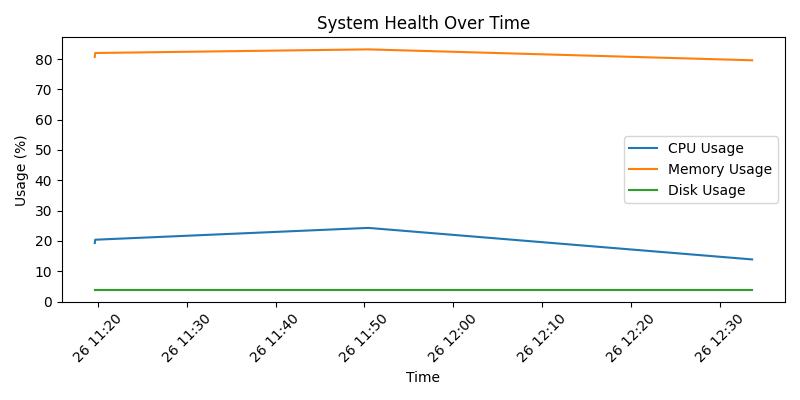

# Automated System Health Check

## Overview
Automated System Health Check is a Python project that monitors system performance by collecting data on CPU, memory, and disk usage. It generates reports with graphical insights and sends email notifications.

This project is designed to run manually via **GitHub Actions**, making it easy to trigger system health checks and receive automated reports.

## Features
- ✅ **System Resource Monitoring:** Collects CPU, memory, and disk usage statistics.
- ✅ **Report Generation:** Produces PDF reports with graphical data visualization.
- ✅ **Automated Email Reports:** Sends the report via email to configured recipients.
- ✅ **GitHub Actions Integration:** Runs the script manually via GitHub Actions with artifact uploads.

---

## Getting Started

### Prerequisites
Ensure you have the following installed:

- Python 3.x
- Required dependencies (installed via `requirements.txt`)

### Installation

1. Clone the repository:

   ```bash
   git clone https://github.com/yourusername/system-health-check.git
   cd system-health-check
   ```

2. Install dependencies:

   ```bash
   pip install -r requirements.txt
   ```

3. Set up environment variables in a `.env` file (for local execution):

   ```ini
   EMAIL=your_email@gmail.com
   EMAIL_PASSWORD=your_app_password
   RECEIVER_EMAIL=recipient_email@gmail.com
   ```

4. Run the script locally:

   ```bash
   python main.py
   ```

---

## Running via GitHub Actions

The project is configured to run manually via **GitHub Actions**, which allows users to generate system health reports without running the script locally.

### Steps to Run the Workflow:

1. Go to the **Actions** tab in your GitHub repository.
2. Select **"Manual System Health Check"** workflow.
3. Click **"Run workflow"**, and the script will execute.
4. Download the generated report from the workflow's artifacts.

---

## Configuration

### Environment Variables

The script uses environment variables to store sensitive data securely. These variables can be set locally in a `.env` file or via **GitHub Secrets** for GitHub Actions.

- **EMAIL:** Your email address for sending reports.
- **EMAIL_PASSWORD:** App-specific password for authentication.
- **RECEIVER_EMAIL:** Recipient email address.

## Project Structure

```
.
├── main.py  # Main script to monitor system health
├── requirements.txt       # Dependencies
├── .github/workflows      # GitHub Actions workflow configuration
├── system_health_log.csv  # Log file for system health data
├── system_health_graph.png# Graphical representation of data
└── README.md              # Project documentation
```

---

## Example Report

Sample system health report (generated PDF):



---

## Troubleshooting

- **Email not received?**
  - Ensure email credentials are correct and SMTP settings allow external app access.
  - Check spam/junk folders for the report.

- **Report file not found in artifacts?**
  - Verify the workflow executed successfully in GitHub Actions.
  - Check the console output to confirm file generation.

---

## Future Enhancements
- Running on a AWS hosted VM with:
   - 📊 Improved visualizations with interactive dashboards.
   - ☁️ Cloud storage integration for report archival.
   - 📈 Historical trend analysis over time.

---

## Contributing

Contributions are welcome! Feel free to fork the repository and submit pull requests.

---

## License

This project is licensed under the MIT License.

---
